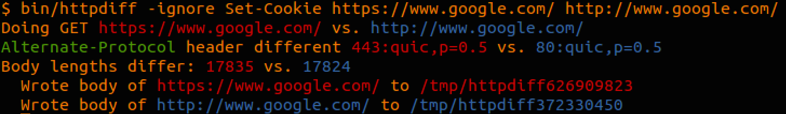

# httpdiff

Perform the same request against two HTTP servers and diff the results. For
best results use in a terminal that supports ANSI escape sequences.

# Installation

```
go get github.com/jgrahamc/httpdiff
go install github.com/jgrahamc/httpdiff
```

# Usage

Simple usage is to give it two URLs to fetch and it will diff the results. If
the bodies are different they are saved to temporary files.

    httpdiff http://www.google.co.uk http://www.google.com/

It's also possible to set the Host header to something other than what's in
the URIs. This is sometimes useful when testing a temporary set up or when
moving servers.

    httpdiff -host example.com http://example.old.com/ http://example.new.com

Specific headers can be ignored with the -ignore option

    httpdiff -ignore Set-Cookie,Date http://x.com http://y.com

The default HTTP method is GET but that can be changed

    httpdiff -method HEAD http://example.com http://example2.com

# Output example on Hacker News showing that Date changes each time


# Output example on Google showing difference between HTTP and HTTPS


